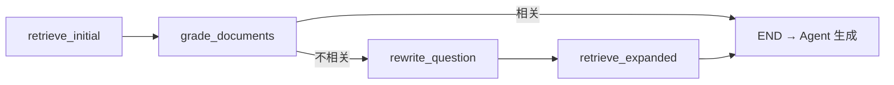

<div align="center">

<h1>喵呜助手 · catRAG</h1>

<p><strong>面向法律知识场景的 RAG 智能问答系统</strong></p>

<p>
  <a href="https://github.com/yaox2689-max/catRAG/stargazers"></a>
  <a href="https://github.com/yaox2689-max/catRAG/network/members"></a>
</p>

<p>
  
  
  
  
  
  <a href="https://github.com/yaox2689-max/catRAG/blob/main/LICENSE"></a>
  <a href="https://github.com/yaox2689-max/catRAG/pulls"></a>
</p>

<p>
  <a href="#快速开始">Quick Start</a> ·
  <a href="#技术架构">Architecture</a> ·
  <a href="#主要-api">API</a> ·
  <a href="#部署">Deploy</a> ·
  <a href="#贡献指南">Contributing</a>
</p>

</div>

---

支持 PDF / Word / Excel 异步入库、图片 OCR、混合向量检索（BGE-M3 + BM25）、LangGraph 可编排检索链路、SSE 流式对话与全链路 `rag_trace` 追溯。

## 核心特性

| 特性 | 说明 |
|------|------|
| **三级语义分块** | 页 → 段 → 句，L3 检索 + Auto-merging 向上聚合父块，缓解上下文碎片化 |
| **混合检索** | BGE-M3 稠密向量 + BM25 稀疏向量，Milvus Hybrid Search + RRF 融合，可选 Jina Rerank |
| **LangGraph 编排** | 初检 → 相关性评分 → 低相关时 Step-Back / HyDE 扩展检索，LLM 路由选择策略 |
| **全链路可观测** | `rag_trace` 记录策略、召回片段、Rerank 分数、页码；SSE 实时推送检索步骤 |
| **多轮对话** | 会话与消息持久化 PostgreSQL，Redis 缓存热数据 |
| **文档异步入库** | PDF / Word / Excel 后台异步解析分块向量化，进度实时反馈 |
| **图片 OCR** | 聊天中上传图片自动 OCR 识别，支持百度 OCR API |
| **RAGAS 评测** | 内置评测脚本 + 黄金测试集，量化 Faithfulness / Context Precision 等指标 |

## 技术架构

<div align="center">

```
┌─────────────┐     SSE / REST      ┌──────────────────────────────────────┐
│  Vue3 前端   │ ◄────────────────► │  FastAPI (backend/app.py)            │
└─────────────┘                     │  · Agent + 工具调用 search_knowledge │
                                    │  · 异步入库/删除 Job                  │
                                    └───────────┬──────────────────────────┘
                                                │
          ┌─────────────────────────────────────┼─────────────────────────┐
          ▼                     ▼                 ▼                         ▼
   ┌─────────────┐      ┌─────────────┐   ┌─────────────┐          ┌─────────────┐
   │ PostgreSQL  │      │   Redis     │   │   Milvus    │          │  LLM API    │
   │ 用户/会话   │      │ 会话缓存    │   │ L3 向量检索 │          │ Ark/OpenAI  │
   │ L1/L2 父块  │      │             │   │ Dense+BM25  │          │ 兼容接口    │
   └─────────────┘      └─────────────┘   └─────────────┘          └─────────────┘
```

</div>

### 三级分块与存储

| 层级 | 语义单元 | 存储 |
|------|----------|------|
| L1 | 整页正文 | PostgreSQL `parent_chunks` |
| L2 | 段落 | PostgreSQL |
| L3 | 句子（超长句按 ~300 token 切分） | Milvus（检索 + 向量） |

检索仅在 **L3** 执行；命中后通过 **Auto-merging** 从 PostgreSQL 拉取 L2/L1 父块，兼顾检索精度与上下文完整性。

### LangGraph 检索流程



扩展阶段支持 **Step-Back**、**HyDE** 及组合策略（由 LLM 路由选择）。

## 快速开始

### 环境要求

- Python >= 3.12
- Node.js >= 18（前端开发）
- Docker & Docker Compose

### 1. 启动基础设施

```bash
git clone https://github.com/yaox2689-max/catRAG.git
cd catRAG
docker compose up -d
```

| 服务 | 端口 | 说明 |
|------|------|------|
| PostgreSQL | 5432 | 库名 `langchain_app` |
| Redis | 6379 | 会话缓存 |
| Milvus | 19530 | 向量库 |
| Attu | 8080 | Milvus 可视化管理（可选） |

### 2. 配置环境变量

```bash
cp .env.example .env
```

编辑 `.env`，至少配置 `ARK_API_KEY`、`MODEL`、`BASE_URL`、`DATABASE_URL`、`REDIS_URL`、`MILVUS_HOST`/`MILVUS_PORT`。

### 3. 安装依赖并启动

```bash
# 后端
uv sync
cd backend && uv run python app.py

# 前端（新终端）
cd frontend && npm install && npm run dev
```

浏览器访问 `http://127.0.0.1:5173`，Swagger 文档访问 `http://127.0.0.1:8000/docs`。

## 主要 API

| 方法 | 路径 | 说明 |
|------|------|------|
| POST | `/auth/register` `/auth/login` | 注册 / 登录 |
| POST | `/chat/stream` | SSE 流式对话（含 `rag_step`、`trace`） |
| GET | `/documents` | 文档列表（管理员） |
| POST | `/documents/upload/async` | 异步入库 |
| DELETE | `/documents/delete/async/{filename}` | 异步删除 |
| POST | `/ocr/upload` | 图片 OCR（用户） |
| POST | `/ocr/upload/admin` | 图片 OCR 并入库（管理员） |

## 项目结构

```
catRAG/
├── backend/
│   ├── app.py              # FastAPI 入口
│   ├── api.py              # REST / SSE 路由
│   ├── crud.py             # Agent 对话、流式输出
│   ├── document_loader.py  # 文档加载 + 三级分块编排
│   ├── semantic_chunker.py # 页/段/句语义切分
│   ├── rag_pipeline.py     # LangGraph 检索图
│   ├── rag_utils.py        # 混合检索、Auto-merging、Rerank
│   ├── milvus_client.py    # Milvus 混合检索
│   ├── embedding.py        # BGE-M3 + BM25
│   └── ocr_service.py      # OCR 服务
├── frontend/               # Vue 3 + Vite
├── data/                   # 上传文档、评测数据
├── docker-compose.yml
├── test_ragas_eval.py      # RAGAS 评测脚本
└── pyproject.toml
```

## RAGAS 评测

```bash
uv run python test_ragas_eval.py --csv data/ragas_eval_gold.csv --preset standard
```

预设：`faithfulness` | `retrieval` | `standard` | `full` | `complete`

## 部署

生产环境部署步骤见 **[deploy/DEPLOY.md](deploy/DEPLOY.md)**（Docker 中间件 + systemd + Nginx + HTTPS）。

## 贡献指南

欢迎贡献！请遵循以下步骤：

1. Fork 本仓库
2. 创建功能分支：`git checkout -b feature/your-feature`
3. 提交更改：`git commit -m 'feat: add your feature'`
4. 推送分支：`git push origin feature/your-feature`
5. 创建 Pull Request

详细规范见 [CONTRIBUTING.md](CONTRIBUTING.md)。

### 提交规范

使用 [Conventional Commits](https://www.conventionalcommits.org/) 格式：

```
feat(rag): add semantic chunking with auto-merging
fix(auth): resolve login compatibility issue
docs(readme): add installation guide
```

## 路线图

- [ ] 支持更多文档格式（PPT、Markdown）
- [ ] 文档版本管理
- [ ] 用户权限细粒度控制
- [ ] 多模型切换
- [ ] 单元测试和集成测试
- [ ] CI/CD 集成
- [ ] 私有化部署文档

## 许可证

本项目采用 [MIT License](LICENSE) 开源许可证。

Copyright (c) 2026 yaox2689-max
